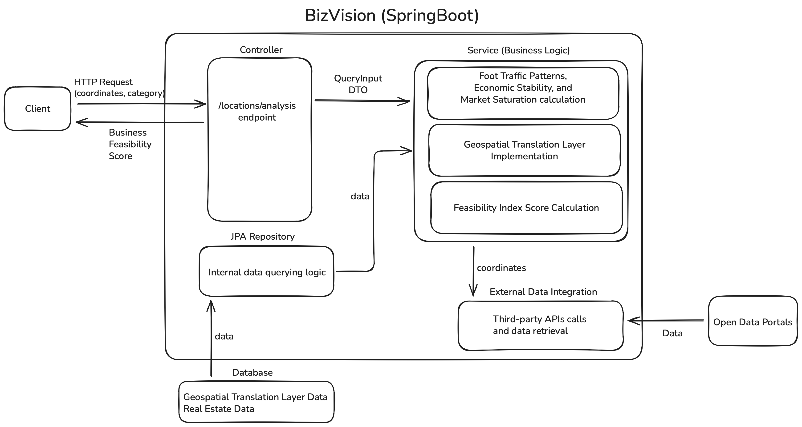

# BizVision

> **Author:** SANDOVAL REYES LUIS ARMANDO  

**BizVision** is a commercial analytics engine that empowers entrepreneurs to make data-driven decisions by calculating business viability using real-time geospatial analytics

---

## Overview

Choosing the right location is the single most critical factor for a new business, yet the data required to make this decision is often unstructured and difficult to interpret. 
Misinterpreting this data often leads to costly failures.

BizVision solves this by aggregating fragmented data sources—such as foot traffic patterns, economic stability, and market saturation—into a unified **Feasibility Index**. This metric provides entrepreneurs with an objective, trustworthy standard for evaluating potential business sites.

---

## Key Features

* **External Data Integration:** Implemented a declarative HTTP client using Spring WebClient to integrate data from various third-party services into a unified data pipeline.
* **Automated Setup:** Automated database population by injecting CSV data via a custom seeder script at deployment.
* **Performance Optimization:** Optimized data handling logic and persistence layers using JPA.
* **Feasibility Algorithm:** Engineered a multi-factor feasibility algorithm that calculates scores based on three pillars: foot traffic patterns, economic stability, and market saturation.
* **Recommendation Engine:** Built a tailored recommendation engine that dynamically adjusts success scores by correlating a business's target audience with local visitor demographics.
* **Data Standardization:** Standardized external data inputs by normalizing them through internal DTOs.

---

## Architecture & System Design

*Figure 1: BizVision System Architecture*

### System Flow
1.  **Client:** Sends an HTTP Request containing coordinates and category to the `locations/analysis` endpoint.
2.  **Controller:** Receives the request and passes a QueryInput DTO to the Service layer.
3.  **Service (Business Logic):**
    * Executes the **Geospatial Translation Layer Implementation** to handle coordinate mapping.
    * Performs calculations for **Foot Traffic Patterns, Economic Stability, and Market Saturation**.
    * Computes the final **Feasibility Index Score** .
4.  **External Data Integration:** Uses coordinates to make Third-party API calls to Open Data Portals for data retrieval.
5.  **Data Persistence (JPA Repository):** Handles internal data querying logic, interacting with the Database (Geospatial Translation Layer Data & Real Estate Data).

---

## Tech Stack

* **Language:** Java 21 
* **Frameworks:** Spring Boot, Spring WebFlux 
* **Database & ORM:** Spring Data JPA, MySQL 
* **Infrastructure:** AWS EC2 (Linux)

---

## Technical Challenges & Solutions

### Challenge: Data Heterogeneity & Geospatial Mismatch
The core engineering challenge was an architectural mismatch between the internal system and the external Data APIs.

* The application relies on raw GPS coordinates (Latitude/Longitude) for user queries.
* However, the Floating Population API required rigid, proprietary "Commercial Area IDs" to return data.
* There was no direct mathematical conversion between coordinates and these IDs.

### Solution: Custom Geospatial Translation Layer
To bridge this gap, I engineered a translation layer using a Reverse Geocoding Strategy:

1.  **Indexing:** Created a mapping table in the database linking the API's "Commercial Area IDs" to their respective physical coordinates.
2.  **Search Optimization:** Instead of scanning all IDs, the system first performs reverse geocoding on the user's input to identify the administrative district (Dong/Gu).
3.  **Heuristic Matching:** The system then queries only the mapped IDs within that specific district, calculating the Euclidean distance to find the nearest valid commercial zone.

### Result
This reduced the search space by approximately **90%**, allowing for near-instant retrieval of population data for any arbitrary coordinate on the map.

---

## Demo

[Watch the Demo Video](https://youtu.be/LDzqV6mNrg) 
